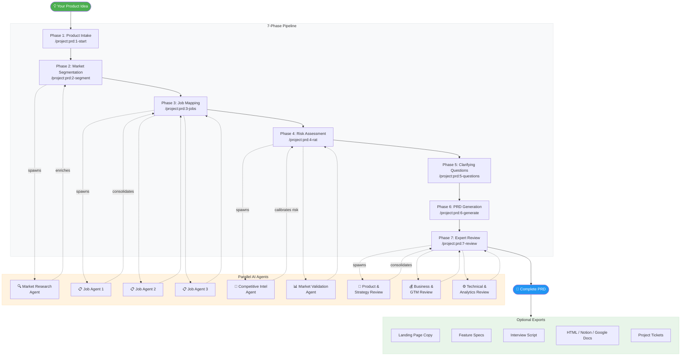

# AJTBD PRD Generator

**Turn a product idea into a professional, research-backed PRD in minutes — not weeks.**

An AI-powered pipeline that applies the **Advanced Jobs To Be Done (AJTBD)** methodology to generate comprehensive Product Requirements Documents. Runs entirely inside [Claude Code](https://docs.anthropic.com/en/docs/claude-code) using slash commands, with parallel AI agents that research your market, map customer jobs, assess risks, and produce a 14-section PRD.

---

## How It Works

The pipeline takes your product idea through 7 structured phases. Each phase builds on the previous one, and the AI carries all context forward automatically. You run one slash command at a time — the AI does the heavy lifting.



---

## What Happens in Each Phase

### Phase 1 — Product Intake
```
/project:prd:1-start My Cool App
```
Collects your product name, description, B2B/B2C classification, current stage, and target market. Creates a dedicated folder for all outputs. Supports resuming existing products.

### Phase 2 — Market Segmentation
```
/project:prd:2-segment
```
Generates **5 AJTBD market segments** — each defined by shared jobs and execution criteria, not demographics. A sub-agent performs live web research to ground TAM/SAM/SOM estimates, identify competitors, and find pricing benchmarks. You pick the segment that fits best.

### Phase 3 — Job Mapping
```
/project:prd:3-jobs
```
For each Core Job in your chosen segment, a **parallel sub-agent** maps the complete sequence of sub-jobs — from initial trigger through completion. Each sub-job includes context, triggers, success criteria, and problem severity scores. All agents run simultaneously for speed.

### Phase 4 — Risk Assessment (RAT)
```
/project:prd:4-rat
```
Produces **5 ranked risk cards** using the Riskiest Assumption Testing framework. Two sub-agents run in parallel: one researches competitors (pricing, user sentiment, failure stories) and one researches market signals (demand trends, regulations, recent funding). Risk scores are calibrated with real evidence.

### Phase 5 — Clarifying Questions
```
/project:prd:5-questions
```
Asks **20 targeted questions** across 7 categories (vision, users, scope, tech, UX, business, timeline). Questions already answered by prior phases are pre-filled — you only answer what's genuinely new.

### Phase 6 — PRD Generation
```
/project:prd:6-generate
```
Synthesizes all prior phases into a **14-section PRD**: executive summary, problem statement, target segment, job map, risk assessment, feature requirements, NFRs, success metrics, MVP phasing, technical architecture, go-to-market strategy, timeline, open questions, and appendix.

### Phase 7 — Expert Review
```
/project:prd:7-review
```
Three expert AI agents review your PRD **simultaneously** from different angles:
1. **Product & Strategy** — completeness, AJTBD adherence, scope realism
2. **Business & Go-to-Market** — pricing, market sizing, channel-segment fit
3. **Technical & Analytics** — architecture, NFRs, metric measurability

Findings are deduplicated, prioritized (Critical / Improvement / Polish), and you choose which fixes to apply.

---

## Optional Exports

After completing the pipeline, generate additional deliverables:

| Command | Output |
|---------|--------|
| `/project:extras:landing-page` | AJTBD-structured landing page copy (9 sections) |
| `/project:extras:prd-to-features` | Individual feature specs with job mapping & acceptance criteria |
| `/project:extras:interview-script` | User interview script organized by Core Job |
| `/project:extras:prd-export-html` | Self-contained HTML with table of contents & print styles |
| `/project:extras:prd-export-notion` | Notion-formatted export (pushes directly if Notion MCP is configured) |
| `/project:extras:prd-export-gdocs` | Google Docs-compatible HTML for import |
| `/project:extras:prd-export-tickets` | Structured project tickets for Linear / Jira / GitHub Issues |

---

## Why AJTBD?

Traditional PRDs start with features or user stories. AJTBD starts with **jobs** — what people are actually trying to accomplish and why.

| Traditional Approach | AJTBD Approach |
|---------------------|----------------|
| Starts with features or personas | Starts with jobs and motivations |
| Segments by demographics or role | Segments by shared jobs + execution criteria |
| Risk assessment is ad hoc | Structured Riskiest Assumption Testing with evidence |
| Market research is separate | Market research is embedded in every phase |
| PRD is static | PRD is reviewed by 3 specialized AI reviewers |

**Key benefits:**

- **Research-grounded** — Every phase uses live web research. Market sizes, competitors, and pricing are sourced from real data, not guesses.
- **Methodology-driven** — AJTBD ensures your PRD is built around what customers actually need, not what you assume they want.
- **Parallel AI agents** — Sub-agents run simultaneously to research, map, and review, completing in minutes what would take days manually.
- **Interactive & iterative** — You confirm, adjust, or redo any phase. The AI adapts to your input at every step.
- **End-to-end** — From a one-line idea to a reviewed 14-section PRD, landing page copy, feature specs, interview scripts, and project tickets.
- **Multi-product** — Manage multiple products in parallel, each with its own output folder and phase state.

---

## Getting Started

### Prerequisites

- [Claude Code CLI](https://docs.anthropic.com/en/docs/claude-code) installed and configured
- Node.js (for MCP servers)
- Python + `uvx` (for the fetch MCP server)

### Setup

1. Clone this repository:
   ```bash
   git clone https://github.com/your-username/ajtbd-prd-generator.git
   cd ajtbd-prd-generator
   ```

2. The two bundled MCP servers (sequential-thinking and fetch) will start automatically when needed. No additional setup required.

3. Start the pipeline:
   ```bash
   claude
   ```
   Then in Claude Code:
   ```
   /project:prd:1-start My Product Name
   ```

4. Follow each phase in order. The AI will tell you which command to run next.

---

## Output Structure

Each product gets its own folder. The pipeline tracks which product is active via a `.current` marker file.

```
prd-output/
├── .current                     ← active product (plain text)
├── my-cool-app/
│   ├── phase-1-intake.md        ← product context
│   ├── phase-2-segments.md      ← 5 segments + selected segment
│   ├── phase-3-jobs.md          ← job graphs for all Core Jobs
│   ├── phase-4-risks.md         ← 5 risk cards with evidence
│   ├── phase-5-answers.md       ← clarifying question answers
│   ├── prd-final.md             ← full 14-section PRD
│   ├── phase-7-review.md        ← consolidated review report
│   ├── landing-page-copy.md     ← (optional)
│   ├── feature-specs.md         ← (optional)
│   ├── interview-script.md      ← (optional)
│   ├── prd-export.html          ← (optional)
│   ├── prd-notion.md            ← (optional)
│   ├── prd-gdocs.html           ← (optional)
│   └── project-tickets.md       ← (optional)
└── another-product/
    └── ...
```

---

## Optional Integrations

The pipeline includes two MCP servers out of the box (`.mcp.json`):
- **Sequential Thinking** — structured reasoning for complex analysis
- **Fetch** — enhanced web content extraction

For exporting to external tools:

### Notion
Push your PRD directly to Notion:
```bash
claude mcp add --transport http notion https://mcp.notion.com/mcp
```
Requires Notion OAuth. Without it, the export generates a local markdown file instead.

### Google Docs
Install a Google Docs MCP server with Google OAuth. Without it, the export generates an HTML file you can import manually.

### Linear / Jira / GitHub Issues
Install your preferred issue tracker MCP server. Without it, the export generates structured ticket specs in markdown.

---

## Standalone Prompts

The `prompts/` directory contains standalone AJTBD prompts for one-off analysis without the full pipeline:

| File | Purpose |
|------|---------|
| `segment-b2b-en.md` | B2B segmentation analysis |
| `segment-b2c-en.md` | B2C segmentation analysis |
| `job-graph-en.md` | Job graph mapping |
| `rat-en.md` | Riskiest Assumption Test |
| `questions-en.md` | Clarifying questions for PRD |
| `landing-page-en.md` | Landing page copy structure |

---

## Rules

All phases follow these shared rules:
- **No "pain" language** — AJTBD uses jobs, motivations, criteria, situations, and triggers
- **US market default** — unless specified otherwise in Phase 1
- **Skip / go back** — say "skip" to move past a phase or "go back" to redo one
- **Phase continuity** — every phase reads prior outputs automatically; if a file is missing, you're told which command to run

---

## License

MIT
